<!-- page_number: true -->
<!--$theme: gaia-->

　
# 遥感数字图像处理实验课
## - 图像增强
## - image enhancement
<br/><br/>
崔家梁  
(cuijialiang@pku.edu.cn)  
2018年11月

---
# 基于直方图的图像增强方法
- 直方图均衡
# 基于卷积模版的图像增强方法
- 高通/低通滤波


---
# 图像的直方图
<!--直方图是图像的一种统计结果,反应图像整体像素分布情况-->
- 统计信息  
- 反应整体  

---


---
# PS中的曲线调整 Cruve
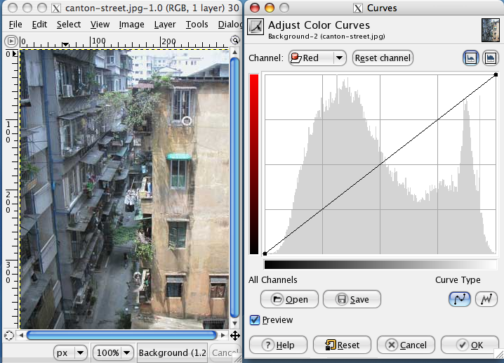

---
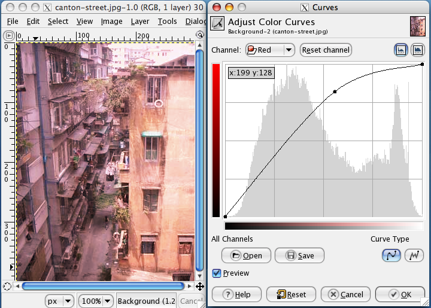
<!--上图是GIMP软件中曲线调整的演示 图片来自wikipedia-->

---
# 直方图均衡化 histogram equalization-算法


---


具体数学实现可以参考https://en.wikipedia.org/wiki/Histogram_equalization

---
# 直方图均衡化-效果


<!--上图是直方图均衡化的演示 图片来自wikipedia和opencv官网-->


---
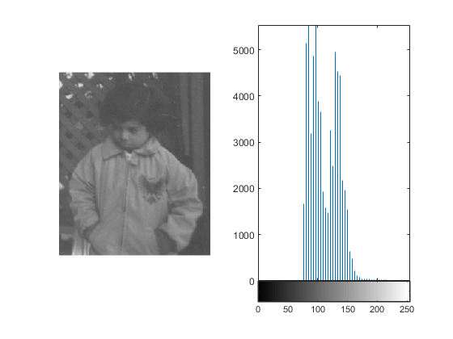
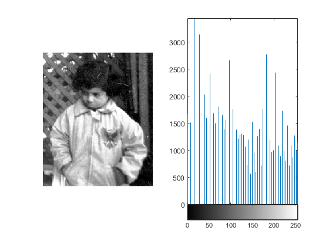
<!--上图是matlab中直方图均衡化的演示 图片来自mathwork-->

---
# 直方图均衡化- 无法做到的
- 无法弥补未采集到的高频信息

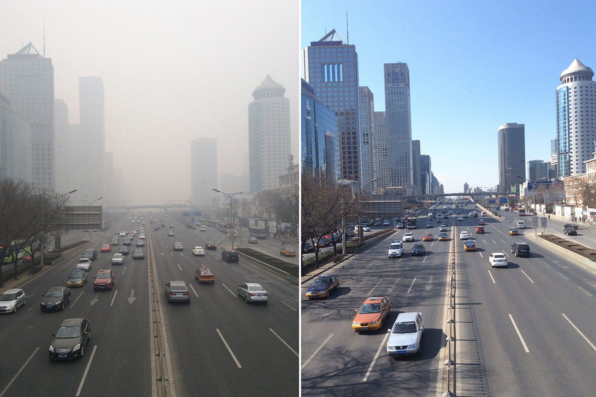
<!--北京雾霾对比 图片来自网易新闻::郑清雄/CFP-->


---
# 题外话 - What is WHITE 什么是白色
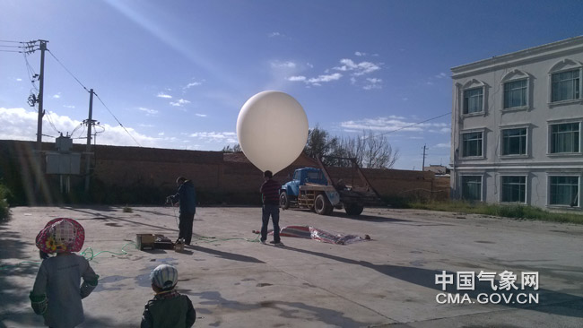
<!--上图是科研人员正在进行卫星传感器定标 图片来自中国气象网-->

---

## 题外话 - why enhancement&about information
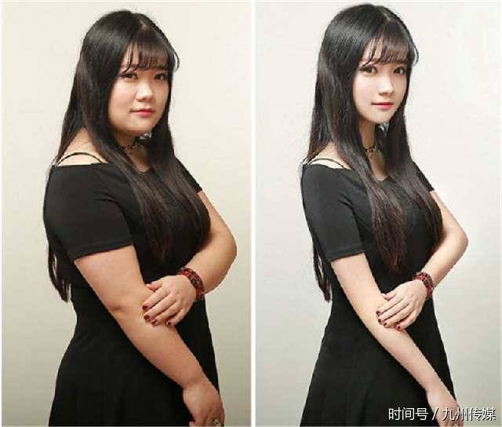

---

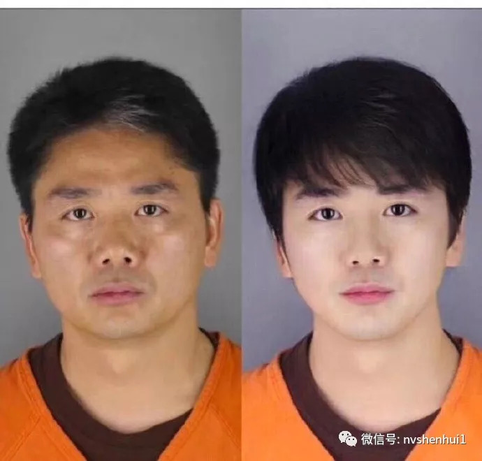

---
# 题外话 - why enhancement&about information
大多数图像处理操作容易：
- 让人类更容易识别（凸显出重要信息）----作用
- 损失一部分信息-------------------------------代价

---

# 多波段图像
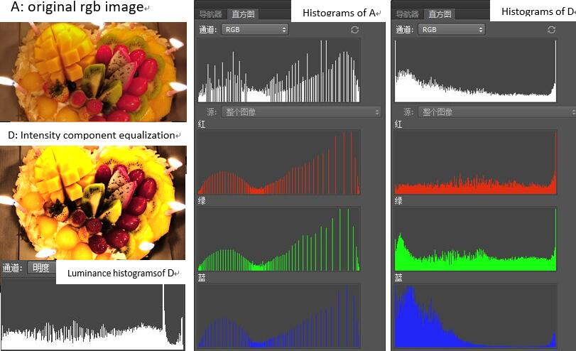
<!--多波段图像直方图均衡化 图片来自wikipedia-->

---
# 题外话 - 为什么三个波段是RGB

---
## 题外话 - 为什么三个波段是RGB
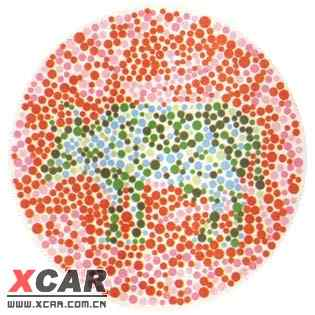

---
## 题外话 - 为什么三个波段是RGB
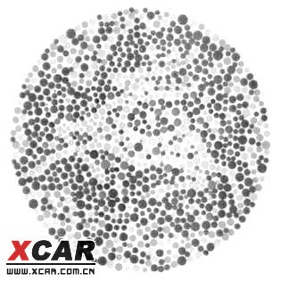

---
## 人类对颜色的感知 - 视锥细胞 cone cell


---
## CIE1931


---
## CIE1931
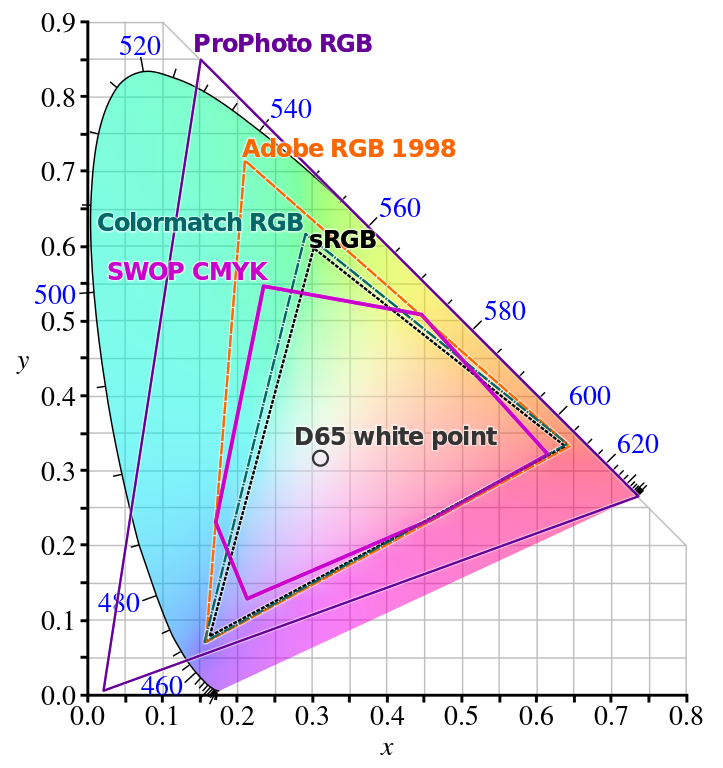

---
# 基于模版的图像处理方法

---

# 卷积操作


---
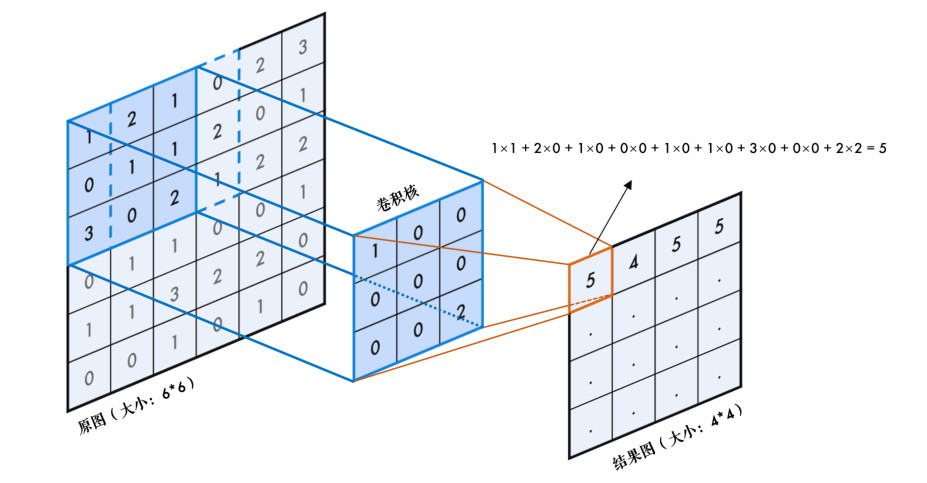

---

# 卷积 - 一种可能的实现
```
def conv(img, kernel):
  res = a_new_img
  for i_i in range(height_img):
    for j_i in range(width_img):
      val = 0
      for i_k in range(height_kernel):
        for j_k in range(width_kernel):
          val += img[i_i,j_i] * kernel[i_k,j_k]
      res[i_i][j_i] = val
  return res
```

---

# 频域滤波

- 高通滤波
  通过高频信息(边界,噪声等)
- 低通滤波
  通过低频信息(物体大致形状等)

---
# 高通与低通滤波

---
# 低通滤波
- 去除噪声,图像平滑
高斯低通滤波:

---
# 高通滤波
- 噪声提取,图像锐化


---
# 边缘检测
sobel算子边缘检测
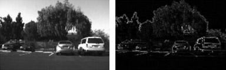 
canny算子边缘检测
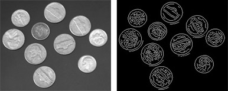
模糊逻辑(fuzzy logic method)
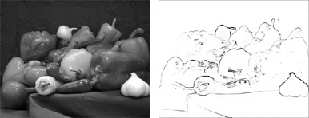

# 卷积操作
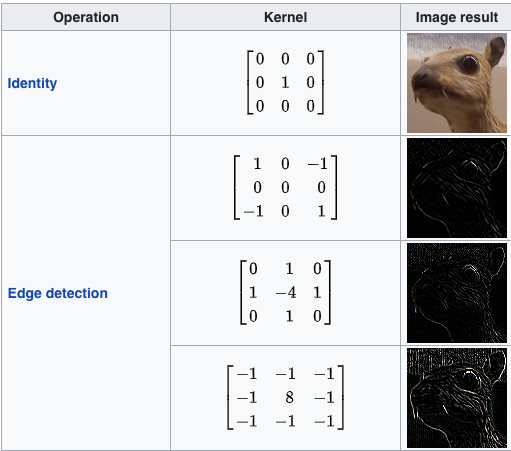
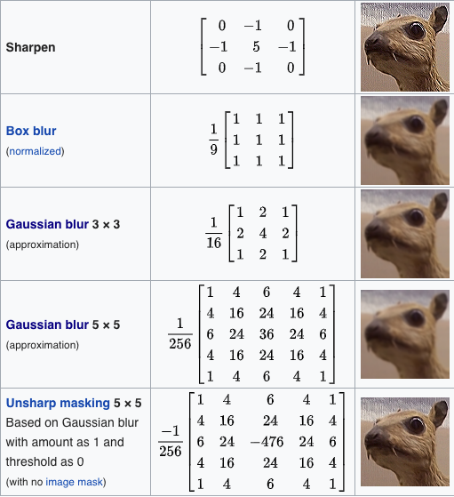

---
# 参考文献

- https://www.evl.uic.edu/sjames/cs525/final.html GPU卷积操作
- gan enhancement https://www.youtube.com/watch?v=d7OXb2sqoec

---
## 作业 - 以下内容实现之一
- 直方图均衡化 
- 实现高通,低通滤波
- 实现某种边缘检测

请于下周三(12月5日)10:00前提交至  cuijialiang@pku.edu.cn