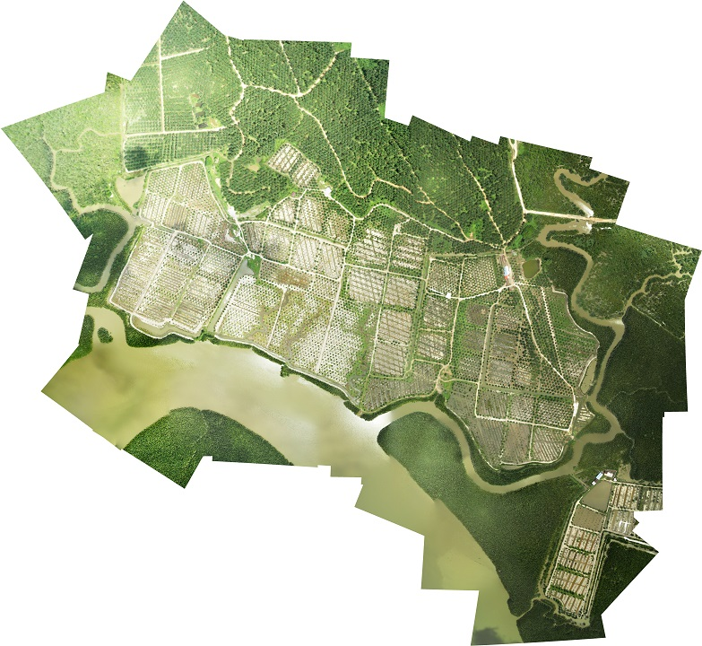
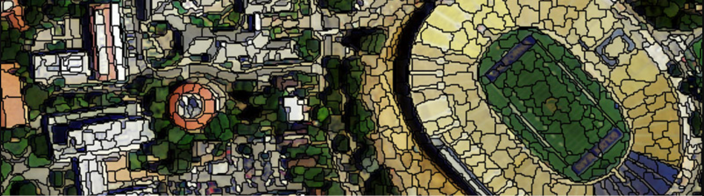

# 可供选题1-图像拼接

TIPS:
-  特征匹配可以调库
-  需要实现
   - 图像关系定义与确定  
   - 最终图像生成 

# 可供选题2-图像特征提取与匹配

- 至少实现一种图像特征提取算法(SIFT,SURF,ORB,FAST,BRIEF等)

# 可供选题3-图像像素分类

TIPS:
- 像素级别分类(并不是整张图像打一个标签)

# 可供选题4-图像分割

# 作业要求
- 可以选择我推荐的选题,可以重复,也可以自己选之后告诉我.  
- 自己准备数据(建议借此了解一下网上的各种遥感数据集).  
- 要有一定代码量,需要有一定的技术实现,不能整套流程调用高级函数完成.  
- 需要提交源代码,文档等.  
- 学期末会有一次课上演示,需要展示结果,讲解算法并答疑.  

# 分组要求
- 4~5人一组,选出组长.  
需要在下周三(2018.12.5)前完成组队,选出组长并确定题目.请组长将题目与组员信息在2018.12.5 10:00前发到cuijialiang@pku.edu.cn
