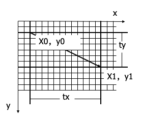
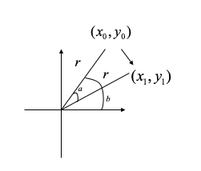
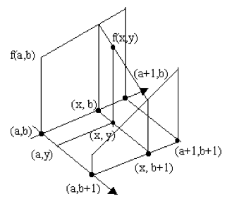
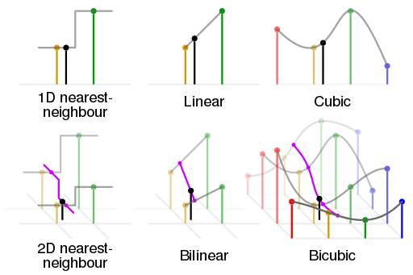

<!-- page_number: true -->
<!--$theme: gaia-->

　
# 遥感数字图像处理实验课
## - 几何变换
  
崔家梁  
(cuijialiang@pku.edu.cn)  
2018年11月

---
# 几何变换
- 平移
- 缩放
- 旋转
- 单应性变换
- 双线性插值
- 几何变换与三维成像

---

# 平移

$\begin{cases}x1=x0+tx \\\ y1=y0+ty \end{cases}$  
&nbsp;&nbsp; &nbsp; &nbsp; &nbsp; &nbsp; ⬇️  
$\begin{cases}x0=x1-tx \\\ y0=y1-ty\end{cases}$  

- 平移后的每个点与原图一一对应
- 不在原图中的点:
  - 有损: 统一赋值0或255
  - 无损: 扩大新图宽度和高度

---
# 平移(接上)

$\begin{bmatrix}x1 \\\ y1 \\\ 1 \end{bmatrix}= \begin{bmatrix} 1 & 0 & tx \\\ 0 & 1 & ty \\\ 0 & 0 & 1 \end{bmatrix}\begin{bmatrix}x0 \\\ y0 \\\ 1 \end{bmatrix}$  
&nbsp;&nbsp; &nbsp; &nbsp; &nbsp; &nbsp; ⬇️  
$\begin{bmatrix}x0\\\ y0\\\ 1\end{bmatrix}=\begin{bmatrix}1&0&-tx\\\ 0&1&-ty\\\ 0&0&1\end{bmatrix}\begin{bmatrix}x1\\\ y1\\\ 1\end{bmatrix}$  

---
# 缩放

$\begin{cases}x1=x0* fx\\\ y1=y0* fy\end{cases}$  
&nbsp;&nbsp; &nbsp; &nbsp; &nbsp; &nbsp; ⬇️  
$\begin{cases}x0=x1/fx\\\ y0=y1/fy\end{cases}$  

---
# 缩放(接上)

$\begin{bmatrix}x1\\\ y1\\\ 1\end{bmatrix}=\begin{bmatrix}fy&0&0\\\ 0&fy&0\\\ 0&0&1\end{bmatrix}\begin{bmatrix}x0\\\ y0\\\ 1\end{bmatrix}$  
&nbsp;&nbsp; &nbsp; &nbsp; &nbsp; &nbsp; ⬇️  
$\begin{bmatrix}x0\\\ y0\\\ 1\end{bmatrix}=\begin{bmatrix}1/fx&0&0\\\ 0&1/fy&0\\\ 0&0&1\end{bmatrix}\begin{bmatrix}x1\\\ y1\\\ 1\end{bmatrix}$

---
# 旋转
$\begin{cases}x0=r* cosb\\\ y0=r* sinb\end{cases}$  
$\begin{cases}x1=r* cos(b-a)=r* cosb* cosa+r* sinb* sina=x0* cosa+y0* sina\\\ y1=r* sin(b-a)=r* sinb* cosa-r* cosb* sina=-x0* sina+y0* cosa\end{cases}$  

---
# 旋转(接上)
$\begin{bmatrix}x1\\\ y1\\\ 1\end{bmatrix}=\begin{bmatrix}cosa&sina&0\\\ -sina&cosa&0\\\ 0&0&1\end{bmatrix}\begin{bmatrix}x0\\\ y0\\\ 1\end{bmatrix}$  
&nbsp;&nbsp; &nbsp; &nbsp; &nbsp; &nbsp; ⬇️  
$\begin{bmatrix}x0\\\ y0\\\ 1\end{bmatrix}=\begin{bmatrix}cosa&-sina&0\\\ sina&cosa&0\\\ 0&0&1\end{bmatrix}\begin{bmatrix}x1\\\ y1\\\ 1\end{bmatrix}$  

$\begin{bmatrix}x1\\\ y1\\\ 1\end{bmatrix}=\begin{bmatrix}1&0&-a\\\ 0&1&-b\\\ 0&0&1\end{bmatrix}\begin{bmatrix}cosa&sina&0\\\ -sina&cosa&0\\\ 0&0&1\end{bmatrix}\begin{bmatrix}1&0&a\\\ 0&1&b\\\ 0&0&1\end{bmatrix}\begin{bmatrix}x0\\\ y0\\\ 1\end{bmatrix}$
&nbsp;&nbsp; &nbsp; &nbsp; &nbsp; &nbsp;

---

# 齐次坐标
$\begin{bmatrix}x\\\ y\\\ z\end{bmatrix}=\begin{bmatrix}x/z\\\ y/z\\\ 1\end{bmatrix}$  

可以表示无穷远点

---
# 单应性变换(homography)
  
  

---
# 双线性插值

---
# 双线性插值(接上)
## $(x,y)$点的灰度值$f(x,y)$:  

$\small f(x,y)=(b+1-1)f(x,b)+(y-b)f(x,b+1)$

## 其中

$\small f(x,b+1)=(x-a)f(a+1,b+1)+(a+1-x)f(a,b+1)$  
$\small f(x,b)=(x-a)f(a+1,b)+(a+1-x)f(a,b)$

---
# 插值方法

---
# 几何变换与三维成像
  
$x'Fx=0$  
$x'$和$x$都是齐次坐标  
$F$是一个3x3的矩阵,与  
 - 相机参数(焦距,感光器比例尺等)
 - 两架相机的相对位置(平移,旋转)

有关

---
# 几何变换与三维成像(接上)

$x'Fx=0$  
注意这个方程,实际是一个3元3次方程,已知$x$和$F$时 $x'$有无穷多解

---
# 几何变换与三维成像(接上)
  
不同位置拍摄的图片之间的变换不能直接用某种几何变换相互切换

---
# 作业-几何变换
- 1 实现图片的平移,缩放,旋转变换  
- 2 以下内容选一个实现:  
  - 三次卷积插值  
  - 单应性变换  
  - 无损变换(自动调整图片大小)  

---
# 作业-几何变换(接上)
要求：  
  - 可用python(推荐),matlab或c++实现  
  - 请直接从底层的数组操作实现各种算法,不要调用pillow,opencv或matlab中的高级函数  
  - 请尽量保证完成的程序有较好的可移植性,即我下载了可以直接运行~  

请于下下周三(11月21日)10:00前提交至  cuijialiang@pku.edu.cn

---
# 推荐阅读的资料 & 本文参考文献
- https://en.wikipedia.org/wiki/Homogeneous_coordinates 齐次坐标(推荐)  
- http://www.corrmap.com/features/homography_transformation.php 单应性变换(推荐)  
- https://en.wikipedia.org/wiki/Multivariate_interpolation 插值方法  

---
# 推荐阅读的资料 & 本文参考文献(接上)
- https://docs.opencv.org/2.4/modules/imgproc/doc/geometric_transformations.html 图像几何变换(opencv)  
- https://www.mathworks.com/help/images/geometric-transformations.html 图像几何变换(matlab)  