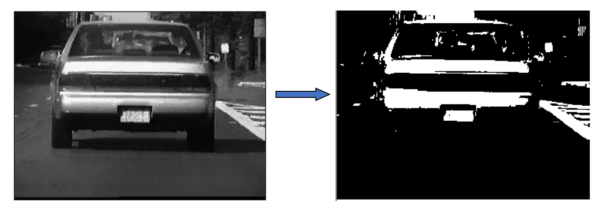
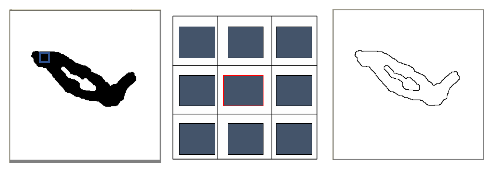
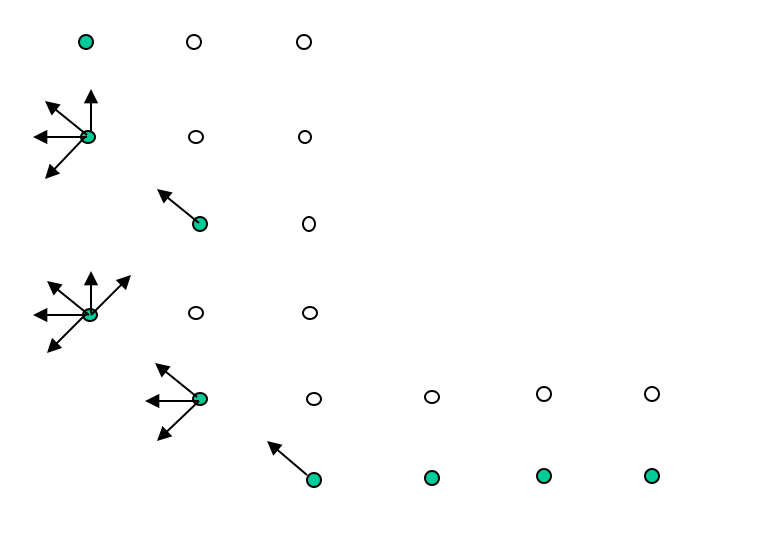
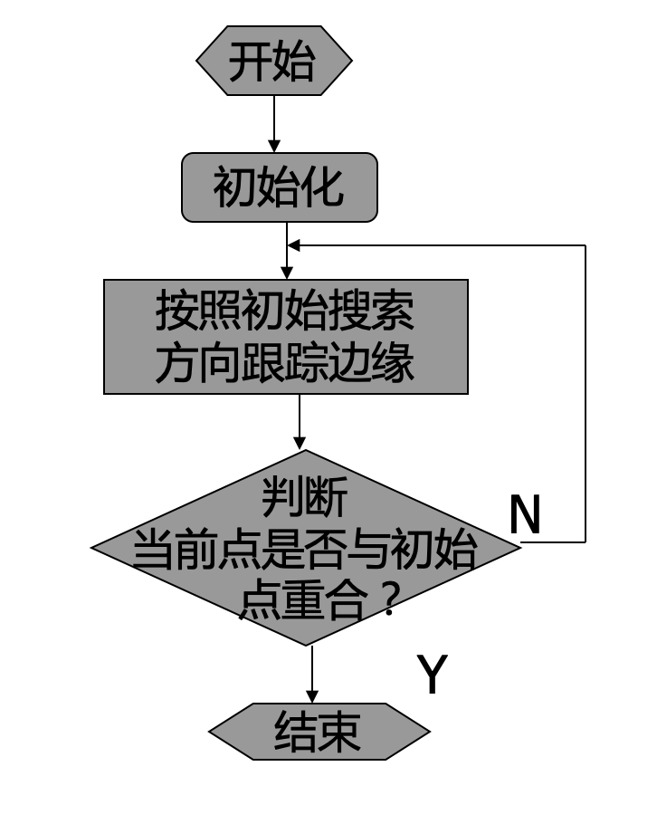

<!-- page_number: true -->
<!--$theme: gaia-->

　
# 遥感数字图像处理实验课
## - 图像二值化
## - 轮廓跟踪
## - 图像分割
 
崔家梁
(cuijialiang@pku.edu.cn)  

---
# 图像二值化

---
# 图像二值化方法
- 利用灰度图像直方图阈值二值化
- 灰度级切片法二值化
- 等灰度片法二值化

---
# 轮廓提取与跟踪

---
# 轮廓提取
二值图像边界提取算法就是掏空内部点：如果原图中有一点为黑，且它的8个相邻点都是黑色时，则将该点删除。

---
# 轮廓跟踪
- 先根据某种严格的“探测准则”找出目标物体轮廓上的像素，给程序一个初始位置；
   - 探测准则：
     - 首先，找到最左下方的边界点，以这个边界点为起始，按照从左到右，从下到上的顺序搜索，找到的第一个不同灰度的点就是最左下方的边界点，以此点为轮廓跟踪初始点。
- 再根据这些像素的某些特征，用一定的“跟踪准则”找出轮廓上的其他像素。

---
# 轮廓跟踪 - 准则
从第一个边界点开始，定义初始的搜索方向为沿左上方；如果上方的点是黑点，则为边界点，否则搜索方向为顺时针旋转45度。这样一直到寻找到第一个黑点为止。然后把这个黑点作为新的边界点，在当前的搜索方向的基础上逆时针旋转90度，继续用同样的方法搜索下一个黑点，直到返回最初的边界点为止。

---
# 轮廓跟踪 - 流程图

---
# 图像分割

---
# 伯克利的图像分割与基准数据集
https://www2.eecs.berkeley.edu/Research/Projects/CS/vision/bsds/

- .m格式的分割groundtruth

---
# 分水岭算法

---
# 盆地与分水岭
 

---
### 对于一张灰度图片(通常为要分割的图像的梯度图)
  
将其想象成一个DEM(右图为加了一个光照的渲染效果)

---
# 填充过程
  
从最低处开始填充,可以得到盆地和分水岭.

---
# 分水岭算法-基本思路
  

左上-原图
右上-梯度图
左下-梯度图的分水岭
右下-将分水岭分割结果显示在原图上

---
# 分水岭算法的问题-分割过细

---
# 分水岭算法的改进算法
- 基于标记的分水岭算法
- 多级分水岭算法

---
# 基于标记的分水岭算法

---
# 多级分割算法-瀑布变换

http://cmm.ensmp.fr/~beucher/wtshed.html

---
# P算法
http://cmm.ensmp.fr/~beucher/publi/P-Algorithm_SB_BM.pdf

---

# References  
- CMM的分水岭介绍 http://cmm.ensmp.fr/~beucher/wtshed.html

- Matlab官网的分水岭介绍 https://cn.mathworks.com/company/newsletters/articles/the-watershed-transform-strategies-for-image-segmentation.html
- 多级分割
http://www.seascapesoft.org/about-seascape/hierarchical-segmentation

---
- 深度学习的图像分割算法总结(2017)
http://blog.qure.ai/notes/semantic-segmentation-deep-learning-review